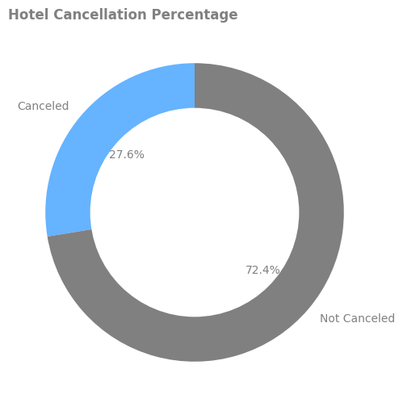
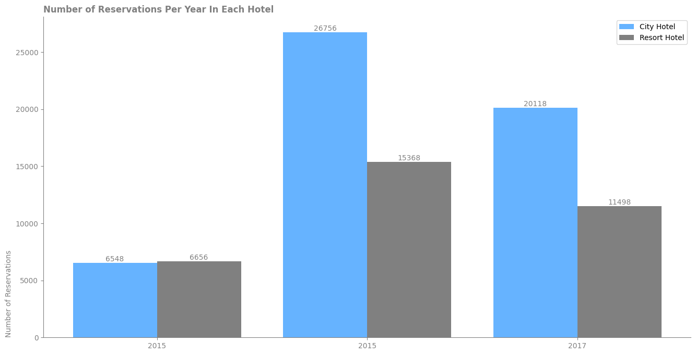

# Analysis Of Hotel Reservations

The dataset was about two hotel, City and Resort hotel. There were 32 columns and duration was from last 2014 to 2017.


## Requirements

This project requires the following modules:
- numpy
- pandas
- matplotlib 
- notebook

## Python Packages Used

- Data Manipulation: Packages used for handling and importing dataset such as pandas, numpy.
- Data Visualization: For visualize the results matplotlib was used to plot.

## Code structure

```
├── Hotel Booking.csv
├── images
├── hotel_dataset_analysis.ipynb
├── README.md
└── .gitignore
```

## Data section

* Data structure description
    - List of tables
        - hotel_df
    - File formats
        - csv file

## Results

There are some analysis about reservation statistics for example peak seasons, passenger nationalities and etc.

For example canceling percentage:





Or in different years, what type of hotels were booked most and booked least:



